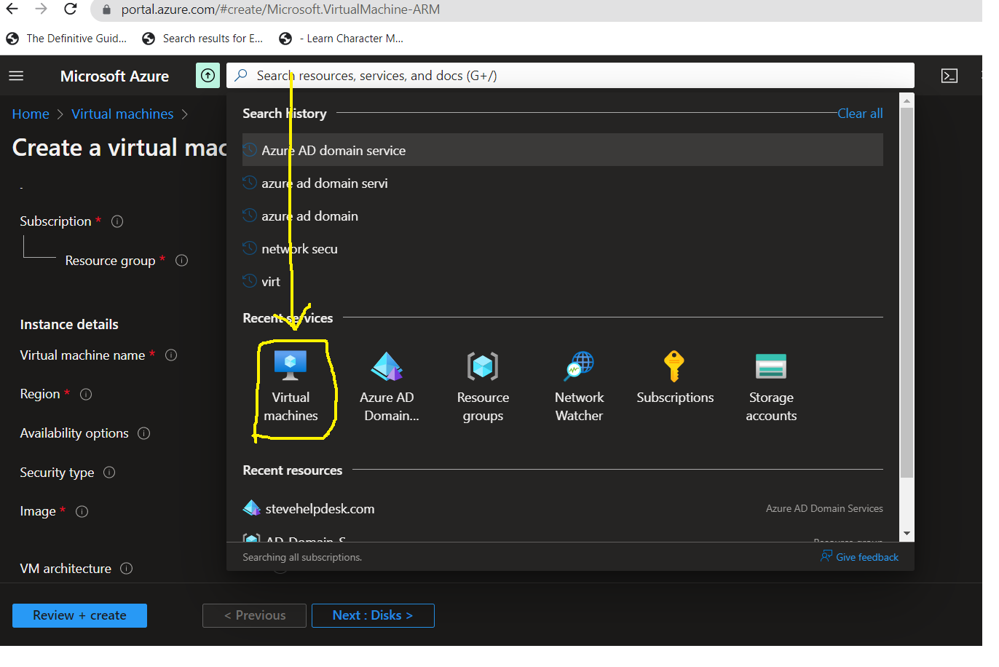
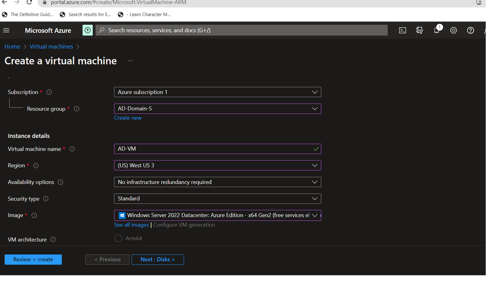
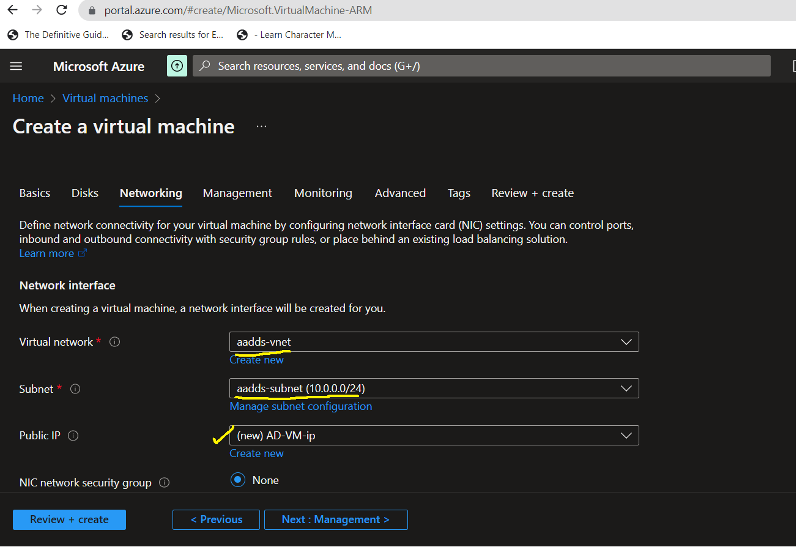
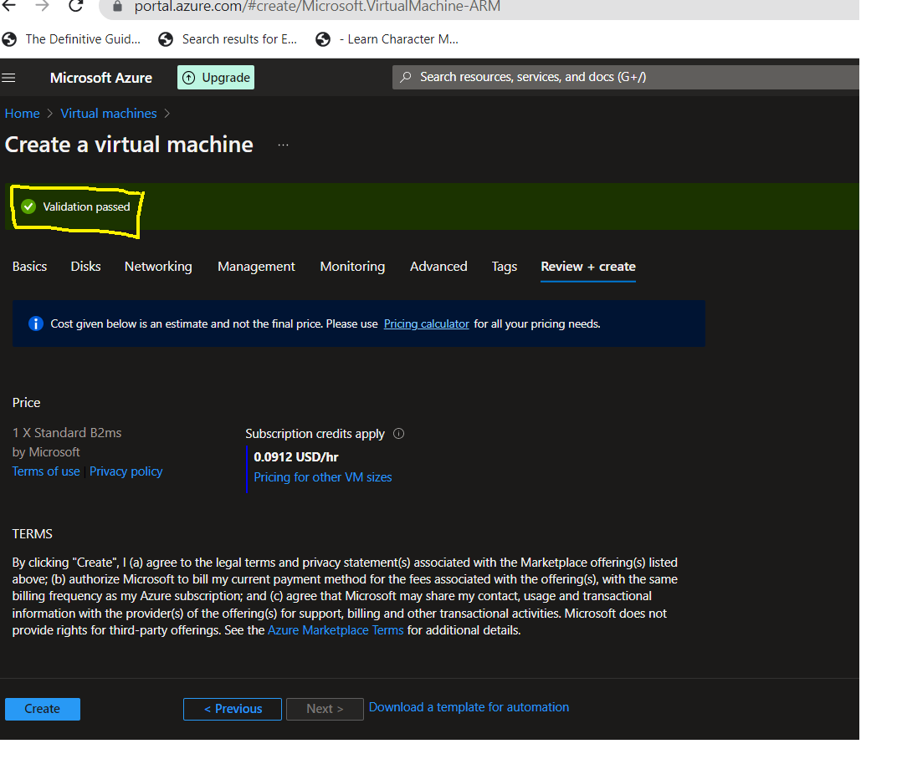
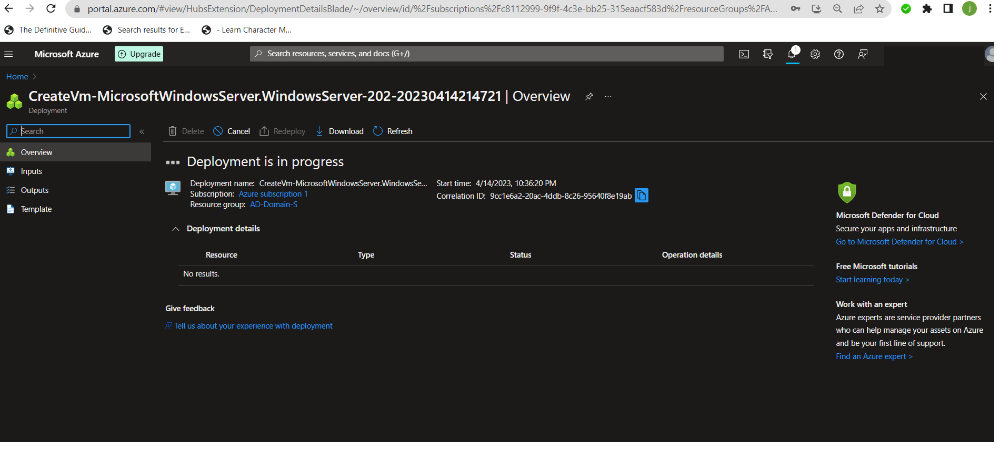
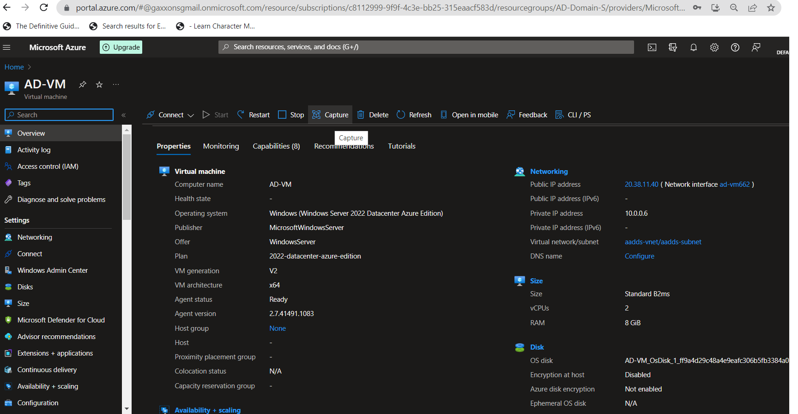
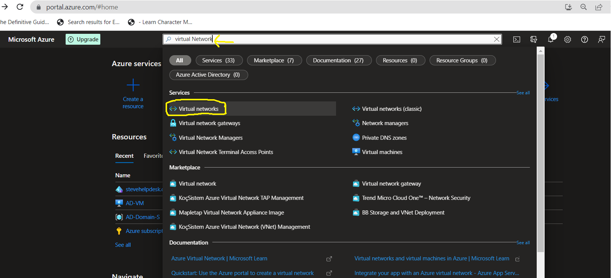
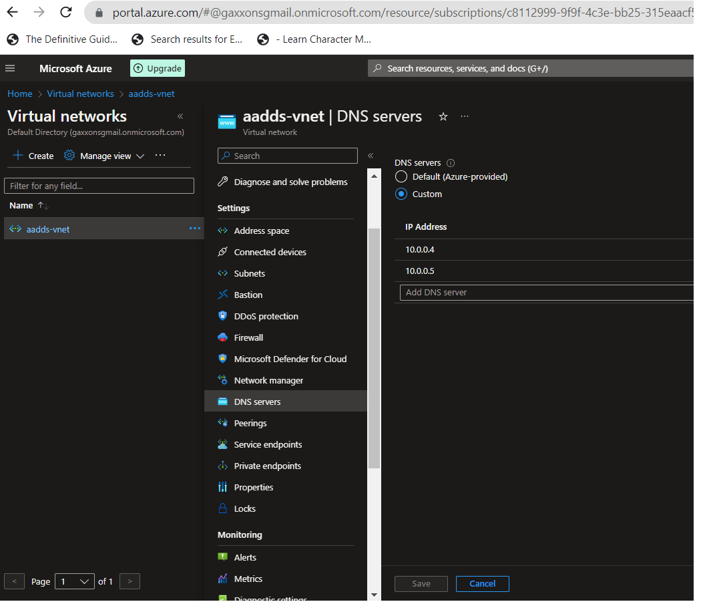
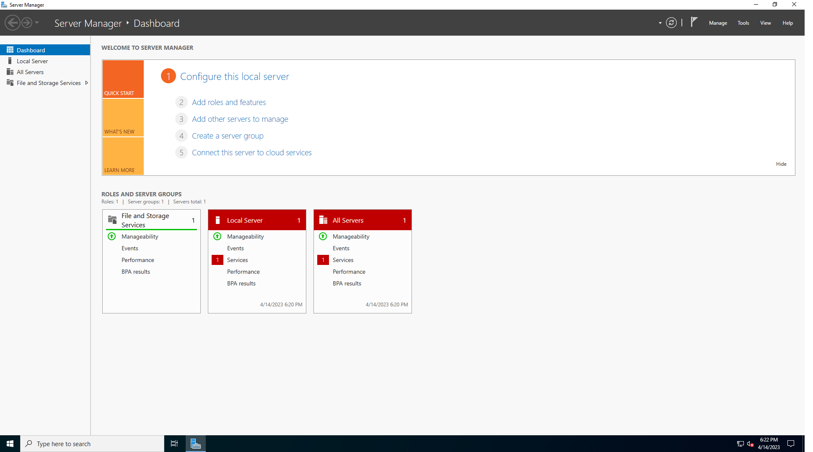

<h1>Basic Azure AD Domain Services and VM Joining Setup.</h1>
Azure Active Directory Domain Services (Azure AD DS) provides managed domain services such as domain join, group policy, LDAP, Kerberos/NTLM authentication that is fully compatible with Windows Server Active Directory. The integration lets users sign in using their corporate credentials, and you can use existing groups and user accounts to secure access to resources..  

<h2>Prerequisites and Technologies Used</h2>

- An active Azure subscription
- Microsoft Azure (Virtual Machines/Compute)
- Remote Desktop
- Virtual Machine with DNS Server
- Various Command-Line Tools
- Various Network Protocols ( RDH, DNS, )

<h2>Operating Systems Used </h2>
- Windows 10 (21H2)
- Windows Server 2022

<h2>Actions and Observations</h2>
<h2>High-Level Steps</h2>

<b>- Step 1:</b>
From Microsoft Azure porta, Search for <b>Azure AD Domain Services</b> and click on the search result <b>Azure AD Domain Services</b>.

<b>- Step 2:</b>
Click on the Create Azure AD Domain Services button on the Azure AD Domain Services window.

<b>- Step 3:</b>
Now select the Azure Subscription and the Resource group. Select your DNS domain name as your wish then Click on Next.

<b>- Step 4:</b>
In the Networking window, Select the Virtual Network and Subnet, or we can create a new Virtual Network as your wish for your managed domain. Then click Next.

<b>- Step 5:</b>
In the Administration window, Leave everything default. Click on Next.

<b>- Step 6:</b>
In the Security Settings windows, Leave everything as default.

<b>- Step 7:</b>
In this section the system will review your configuration to allow you to create.When review is done,then click on Review + create.

<b>- Step 8:</b>
This image displays the Summary of the settings you made in the previouse step. You should remember them.

<b>- Step 9:</b>
We can see that, the deployment under progress. (This can take up to 30 to 40 minutes).

<b>- Step 10:</b>
You can now see, the deployment is completed. 

<h1><u>***The following steps will guide you to create VM.***</u></h1> 

<b>- Step 1:</b>
 Search for a Virtual Machine in the searchbar above.

<b>- Step 2:</b>
We have to create a Windows server Virtual Machine for Azure AD DS Management Tools. Follow the below screenshot to create a VM.

<b>- Step 3:</b>
 In the Networking tab, select the Virtual Network and Subnet connected to the Azure AD Domain Services. Then click Review + create.

<b>- Step 4:</b>
 Now, it will validate all the data entered by me and show you the Validation passed. Click on Create.

<b>- Step 5:</b>
 Now, it will validate all the data entered by me and show you the Validation passed. Click on Create.
 

<b>- Step 6:</b>
 It is time to Add the DNS IP address (Azure AD Domain Services) on the Vnet. From the Searchbar, search for the Virtual Network and click on it. The images below illustrates the process. 
 

<b>- Step 7:</b>
 It is time to Add the DNS IP address (Azure AD Domain Services) on the Vnet. From the Searchbar, search for the Virtual Network and click on it. The images below illustrates the process. 
  
  

 
