

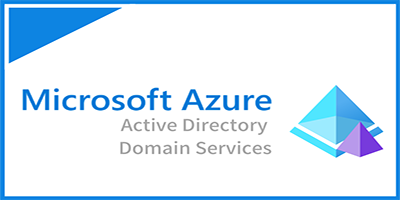

<h1>Basic Azure AD Domain Services and VM Joining Setup.</h1>
Azure Active Directory Domain Services (Azure AD DS) provides managed domain services such as domain join, group policy, LDAP, Kerberos/NTLM authentication that is fully compatible with Windows Server Active Directory. The integration lets users sign in using their corporate credentials, and you can use existing groups and user accounts to secure access to resources..  

<h2>Prerequisites and Technologies Used</h2>

- An active Azure subscription
- Microsoft Azure (Virtual Machines/Compute)
- Remote Desktop
- Virtual Machine with DNS Server
- Various Command-Line Tools
- Various Network Protocols ( RDH, DNS, )

<h2>Operating Systems Used </h2>
- Windows 10 (21H2)
- Windows Server 2022

<h2>Actions and Observations</h2>
<h2>High-Level Steps</h2>

<b>- Step 1:</b>
From Microsoft Azure porta, Search for <b>Azure AD Domain Services</b> and click on the search result <b>Azure AD Domain Services</b>.

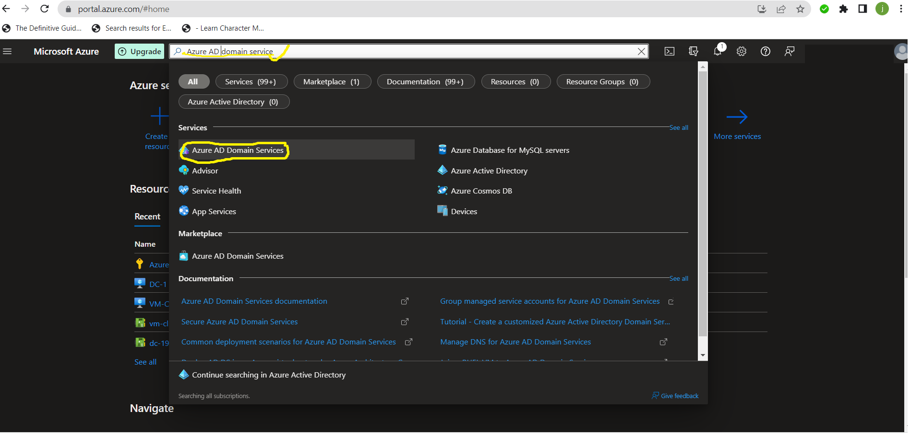

<b>- Step 2:</b>
Click on the Create Azure AD Domain Services button on the Azure AD Domain Services window.

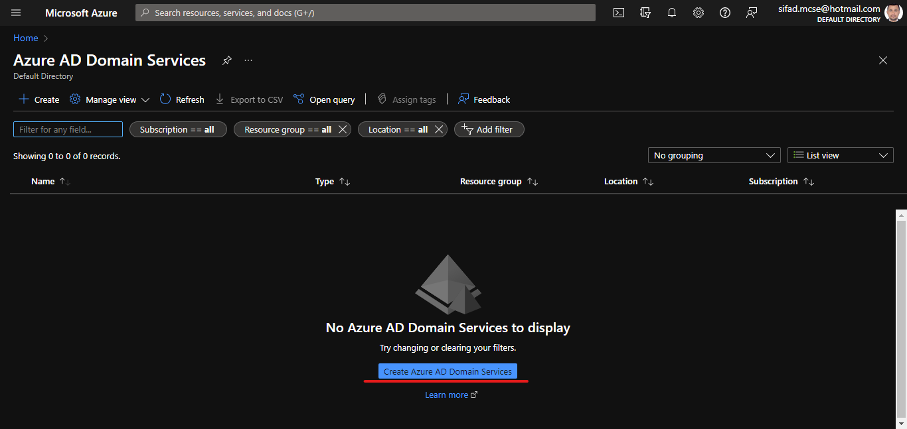

<b>- Step 3:</b>
Now select the Azure Subscription and the Resource group. Select your DNS domain name as your wish then Click on Next.

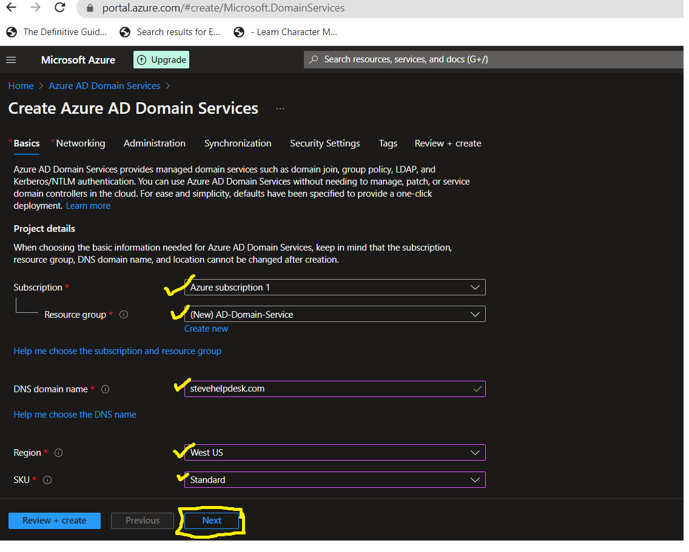

<b>- Step 4:</b>
In the Networking window, Select the Virtual Network and Subnet, or we can create a new Virtual Network as your wish for your managed domain. Then click Next.

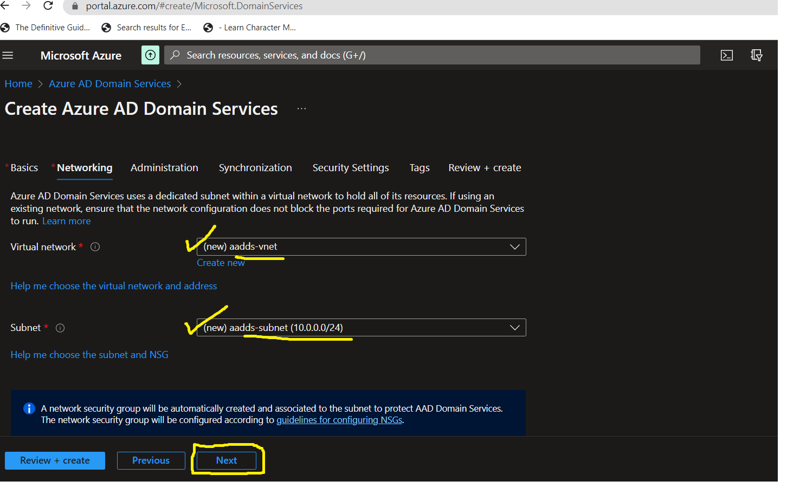

<b>- Step 5:</b>

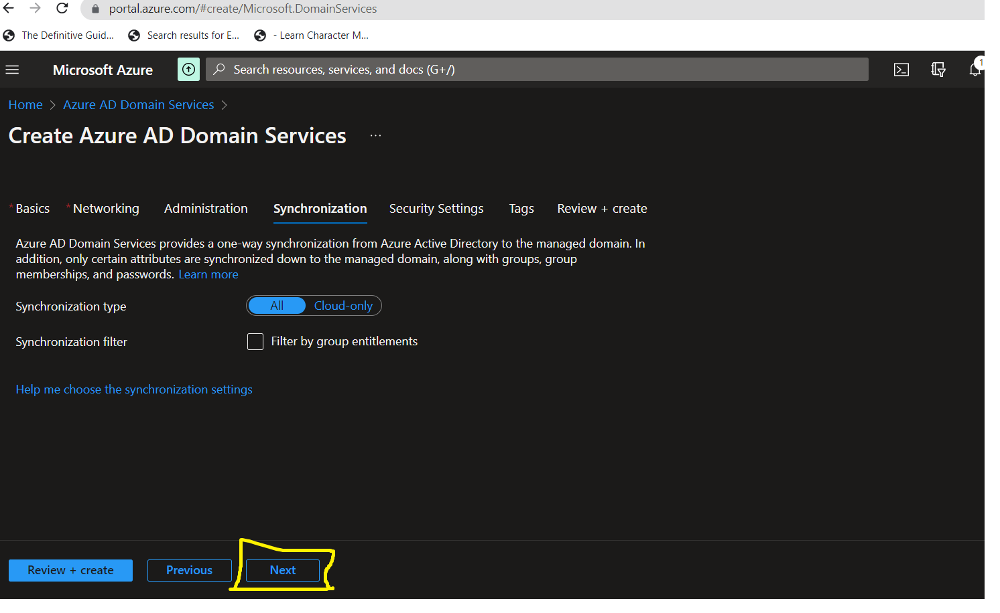

<b>- Step 6:</b>

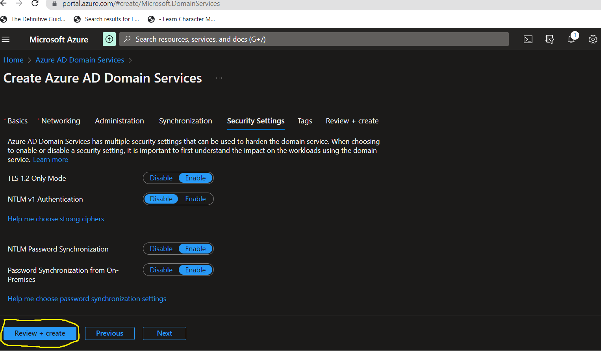

<b>- Step 7:</b>
From Microsoft Azure porta, Search for <b>Azure AD Domain Services</b> and click on the search result <b>Azure AD Domain Services</b>.

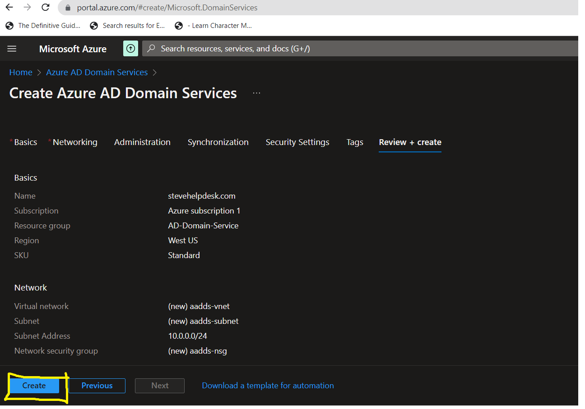

<b>- Step 8:</b>

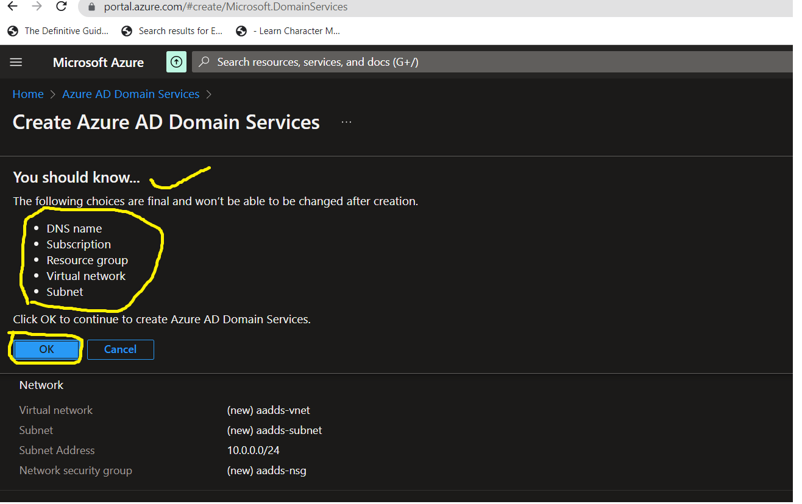

<b>- Step 9:</b>

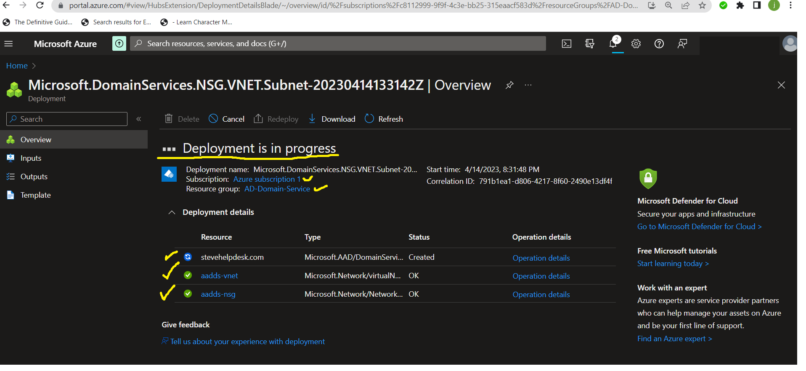

<b>- Step 9:</b>

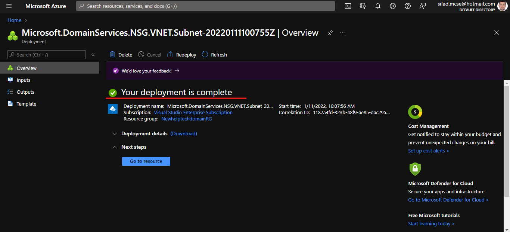

- Step 2
- Step 3
- Step 4

Lorem ipsum dolor sit amet, consectetur adipiscing elit, sed do eiusmod tempor incididunt ut labore et dolore magna aliqua. Ut enim ad minim veniam, quis nostrud exercitation ullamco laboris nisi ut aliquip ex ea commodo consequat. Duis aute irure dolor in reprehenderit in voluptate velit esse cillum dolore eu fugiat nulla pariatur.

 

Lorem ipsum dolor sit amet, consectetur adipiscing elit, sed do eiusmod tempor incididunt ut labore et dolore magna aliqua. Ut enim ad minim veniam, quis nostrud exercitation ullamco laboris nisi ut aliquip ex ea commodo consequat. Duis aute irure dolor in reprehenderit in voluptate velit esse cillum dolore eu fugiat nulla pariatur.

 

Lorem ipsum dolor sit amet, consectetur adipiscing elit, sed do eiusmod tempor incididunt ut labore et dolore magna aliqua. Ut enim ad minim veniam, quis nostrud exercitation ullamco laboris nisi ut aliquip ex ea commodo consequat. Duis aute irure dolor in reprehenderit in voluptate velit esse cillum dolore eu fugiat nulla pariatur.

 
